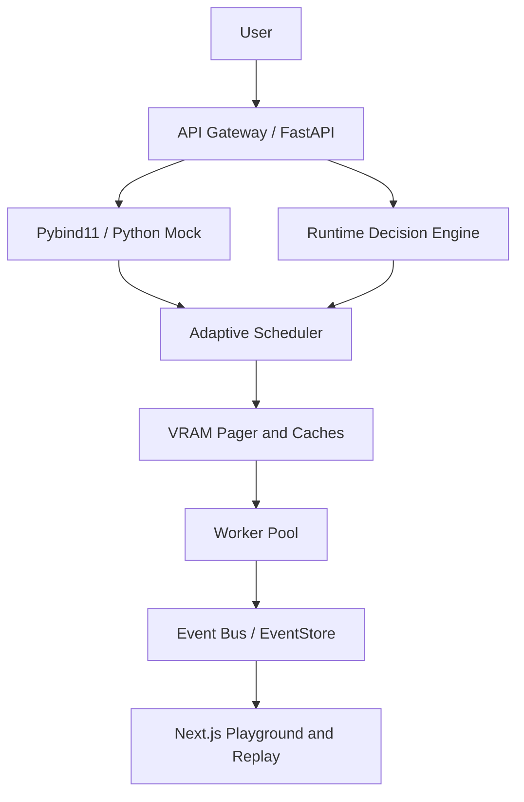

# High Level Design (HLD): CerebrumOS

## 1. Introduction
CerebrumOS is an AI Inference Runtime Platform explicitly modeled after Operating System primitives. By mapping concepts like Process Scheduling (MLFQ), Memory Virtualization (Paging), and Inter-Process Communication (IPC) to AI workloads, the system achieves maximum throughput and minimal latency.

## 2. Architecture Overview
The system is divided into three distinct operational boundaries:

### 2.1 The Ingress Layer (Python/FastAPI)
- **Role:** Handles thousands of highly concurrent HTTP/WebSocket connections.
- **Why Python?:** Python's `asyncio` event loop is exceptional for I/O bound connection pooling.
- **Clean Architecture:** Divided into Routes, Services, and Repositories to enforce strict separation of concerns.
- **Runtime Decision Engine:** Selects FCFS/RR/Priority/MLFQ from live signals and emits structured explainability.

### 2.2 The Systems Engine (C++20)
- **Role:** The highly performant orchestrator.
- **Components:**
  - **Memory Pager:** Virtualizes physical VRAM, breaking tensors into contiguous blocks to solve memory fragmentation.
  - **LRU/LFU Caches:** Manages Prefix Matching (System Prompt caching).
  - **Runtime Decision Engine / Adaptive Scheduler:** Multi-level feedback and signal-driven policy routing.
- **Integration:** Exposes itself to the Ingress Layer via Pybind11 (Python mock fallback when the extension is absent).

### 2.3 The Visualizer (Next.js/React)
- **Role:** Production-grade telemetry + educational playground.
- **Centerpiece:** Runtime Playground — choose scheduler, generate load, inspect decisions/memory/cache, run benchmarks.
- **Also:** Timeline Replay, Decision Engine explainability, Interview Mode, Memory Visualization, Benchmark Dashboard.

## 3. Data Flow Diagram

## 4. Related Documents
- [LLD.md](./LLD.md) — module boundaries and API contracts
- [SCHEDULER_DESIGN.md](./SCHEDULER_DESIGN.md) — policies, complexity, analogies
- [MEMORY_DESIGN.md](./MEMORY_DESIGN.md) — paging, fragmentation, reuse
- [BENCHMARK_METHODOLOGY.md](./BENCHMARK_METHODOLOGY.md) — how comparisons are run
- [EXPERIMENTAL_RESULTS.md](./EXPERIMENTAL_RESULTS.md) — results template for research demos
